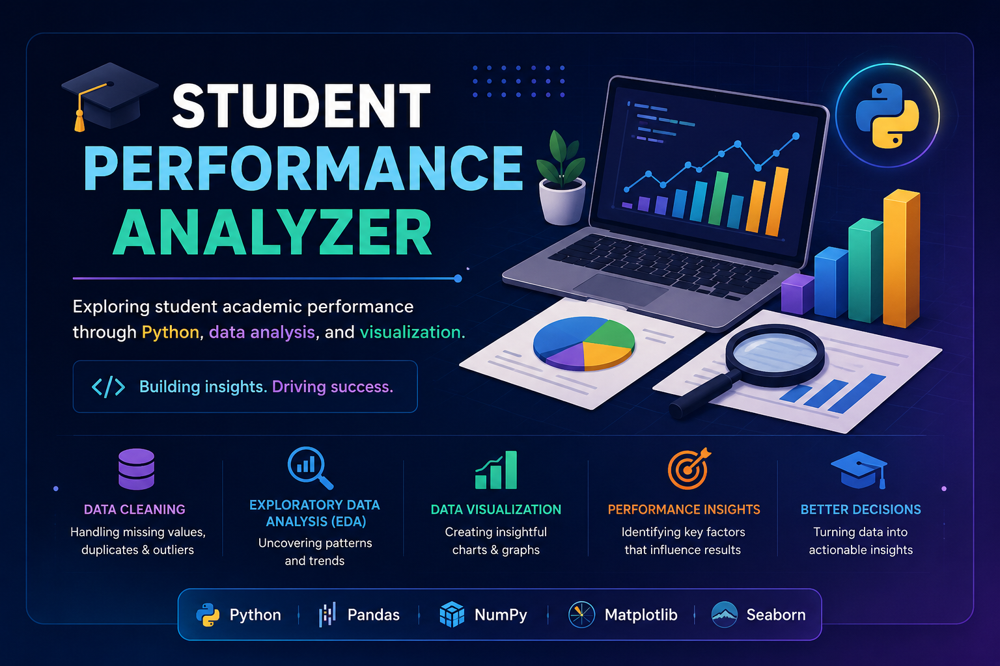

<p align="center">
  
</p>


# 🎓 Student Performance Analyzer

A beginner-friendly **Python Data Analysis** project that explores student academic performance using real-world educational data. This project demonstrates data cleaning, exploratory data analysis (EDA), and visualization techniques to uncover insights into the factors that influence student success.

## 📌 Project Overview

The objective of this project is to analyze student performance data and answer important questions such as:

* How does study time affect final grades?
* Does attendance influence academic performance?
* Which subjects have the highest and lowest average scores?
* What trends and patterns can be identified from the dataset?

Using Python and popular data analysis libraries, this project transforms raw educational data into meaningful insights through statistical analysis and visualizations.


## ✨ Features

* Data Cleaning and Preprocessing
* Exploratory Data Analysis (EDA)
* Statistical Summary
* Data Visualization
* Performance Trend Analysis
* Insight Generation


## 🛠️ Technologies Used

* Python
* Pandas
* NumPy
* Matplotlib
* Jupyter Notebook

---

## 📂 Project Structure

```text
Student-Performance-Analyzer/
│
├── data/
│   └── student-mat.csv
│
├── notebooks/
│
├── images/
│
├── output/
│
├── README.md
└── requirements.txt
```

---

## 📊 Sample Analysis

This project explores relationships between different student attributes and academic performance, including:

* Study Time vs Final Grade
* Attendance Analysis
* Subject-wise Performance
* Distribution of Student Scores
* Statistical Summary of Student Data


## 🚀 Getting Started

## 1. Clone the Repository

```bash
git clone https://github.com/teenamehra2100-hash/Student-Performance-Analyzer.git
```

## 2. Navigate to the Project Folder

```bash
cd Student-Performance-Analyzer
```

## 3. Install Required Libraries

```bash
pip install -r requirements.txt
```

### 4. Launch Jupyter Notebook

```bash
jupyter notebook
```


## 🎯 Future Improvements

* Build a Machine Learning model to predict student performance
* Deploy the project as a web application
* Add additional datasets for comparative analysis
* Improve visualizations with Plotly and Seaborn

## 👩‍💻 Author

*Teena Mehra*

Computer Science student focused on becoming a Software Engineer with strong expertise in Artificial Intelligence and Machine Learning.

This repository is part of my journey to build practical software projects, strengthen problem-solving skills, and create a professional portfolio.

**GitHub:** https://github.com/teenamehra2100-hash


## ⭐ Support

If you found this project useful or interesting, consider giving it a ⭐ on GitHub. It motivates me to build more projects and continue learning.

Thank you for visiting this repository!
